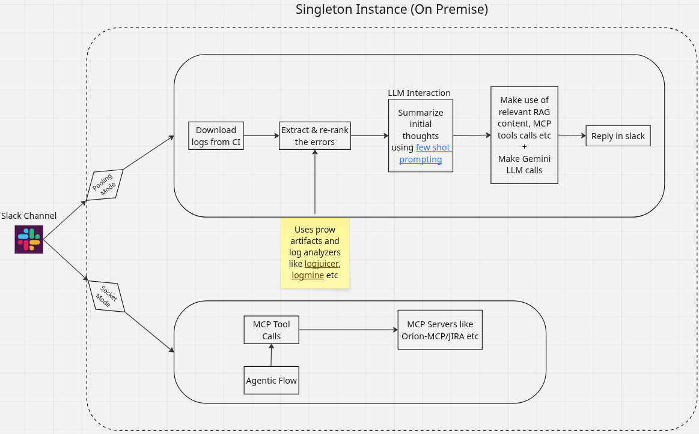

# **BugZooka**
BugZooka is a tool for log analysis and categorization based on static rules and 3rd party LLM integrations.
Product specific LLM prompts are configured in [prompts.json](prompts.json), for generic and error summarization prompts see [prompts.py](bugzooka/analysis/prompts.py). Chat interactions and sessions are not retained.
**Gen AI Notice:** users of this tool should not enter any personal information as LLM prompt input and always review generated responses for accuracy and relevance prior to using the information.

#### High-Level Flow Diagram



## **Environment Setup**

### **Prerequisites**
- Python 3.11 or higher
- pip (Python package manager)

### **Installation**

```bash
git clone <repository_url>
cd BugZooka
python -m venv venv
source venv/bin/activate

# Install dependencies
make install
```

### **Development Setup**
After cloning and setting up the virtual environment:

```bash
# Install dependencies + development tools
make dev-install

# Set up pre-commit hooks (optional)
pre-commit install

# Run tests
make test

# Run linting and formatting
make lint
make format
```

## **Usage**

### **Slack Log Analyzer Bot**
```bash
# Run via Makefile
make run ARGS="--help"

usage: entrypoint.py [-h] [--product PRODUCT] [--ci CI] [--log-level {DEBUG,INFO,WARNING,ERROR,CRITICAL}] [--enable-inference] [--enable-socket-mode]

BugZooka - Slack Log Analyzer Bot

options:
  -h, --help            show this help message and exit
  --product PRODUCT     Product type (e.g., openshift, ansible)
  --ci CI               CI system name
  --log-level {DEBUG,INFO,WARNING,ERROR,CRITICAL}
                        Logging level (e.g., DEBUG, INFO, WARNING, ERROR, CRITICAL). Can also be set via LOG_LEVEL env var
  --enable-inference    Enable inference mode. Can also be set via ENABLE_INFERENCE env var (true/false).
  --enable-socket-mode  Enable Socket Mode for real-time @ mention listening in addition to polling. Can also be set via ENABLE_SOCKET_MODE env var (true/false).
```

### **Integration Modes**

BugZooka supports two complementary modes for monitoring Slack channels that can run simultaneously:

1. **Polling Mode (Always Active)**: Periodically fetches new messages from the Slack channel at regular intervals. This mode automatically processes all failure messages posted to the channel.
   ```bash
   # Run with polling mode only (default)
   make run ARGS="--product openshift --ci prow"
   ```

2. **Socket Mode (Optional Add-on)**: Uses WebSocket connections to listen for @ mentions of the bot in real-time. When enabled, this runs in addition to polling mode, allowing users to trigger on-demand analysis by mentioning the bot.
   ```bash
   # Run with both polling AND socket mode
   make run ARGS="--product openshift --ci prow --enable-socket-mode"
   ```
   
   **Socket Mode Requirements:**
   - An app-level token (`xapp-*`) must be configured as `SLACK_APP_TOKEN`
   - Socket Mode must be enabled in your Slack app settings
   - The bot must have the `app_mentions:read` scope

## **Configurables**
This tool monitors a slack channel and uses AI to provide replies to CI failure messages. Also it operates as a singleton instance.

### **Secrets**
All secrets are passed using a `.env` file which is located in the root directory of this repo. For example
```
### Mandatory fields
SLACK_BOT_TOKEN="YOUR_SLACK_BOT_TOKEN"
SLACK_CHANNEL_ID="YOUR_SLACK_CHANNEL_ID"

### Optional for Socket Mode (required only when using --enable-socket-mode)
SLACK_APP_TOKEN="YOUR_SLACK_APP_TOKEN"  # App-level token (xapp-*) for WebSocket mode
ENABLE_SOCKET_MODE="true"  # Set to "true" to enable Socket Mode alongside polling

### Analysis Mode Configuration
ANALYSIS_MODE="gemini"  # Options: "gemini" (with tool calling support)

### Gemini API Configuration (required when ANALYSIS_MODE=gemini)
GEMINI_API_KEY="YOUR_GEMINI_API_KEY"
GEMINI_API_URL="YOUR_GEMINI_API_URL"
GEMINI_VERIFY_SSL="true"  # Set to "false" for self-signed certificates

### Product based inference details that contain endpoint, token and model details.

// Openshift inference
OPENSHIFT_INFERENCE_URL="YOUR_INFERENCE_ENDPOINT"
OPENSHIFT_INFERENCE_TOKEN="YOUR_INFERENCE_TOKEN"
OPENSHIFT_MODEL="YOUR_INFERENCE_MODEL"

// Ansible inference
ANSIBLE_INFERENCE_URL="YOUR_INFERENCE_ENDPOINT"
ANSIBLE_INFERENCE_TOKEN="YOUR_INFERENCE_TOKEN"
ANSIBLE_MODEL="YOUR_INFERENCE_MODEL"

// Generic inference for fallback
GENERIC_INFERENCE_URL="YOUR_INFERENCE_ENDPOINT"
GENERIC_INFERENCE_TOKEN="YOUR_INFERENCE_TOKEN"
GENERIC_MODEL="YOUR_INFERENCE_MODEL"
```
**Note**: Please make sure to provide details for all the mandatory attributes and for the product that is intended to be used for testing along with fallback (i.e. GENERIC details) to handle failover use-cases.


### **Prompts**
Along with secrets, prompts are configurable using a `prompts.json` in the root directory. If not specified generic prompt will be used. Example `prompts.json` content
```
{
  "OPENSHIFT_PROMPT": {
    "system": "You are an expert in OpenShift, Kubernetes, and cloud infrastructure. Your task is to analyze logs and summaries related to OpenShift environments. Given a log summary, identify the root cause, potential fixes, and affected components. Be precise and avoid generic troubleshooting steps. Prioritize OpenShift-specific debugging techniques.",
    "user": "Here is the log summary from an OpenShift environment:\n\n{summary}\n\nBased on this summary, provide a structured breakdown of:\n- The OpenShift component likely affected (e.g., etcd, kube-apiserver, ingress, SDN, Machine API)\n- The probable root cause\n- Steps to verify the issue further\n- Suggested resolution, including OpenShift-specific commands or configurations.",
    "assistant": "**Affected Component:** <Identified component>\n\n**Probable Root Cause:** <Describe why this issue might be occurring>\n\n**Verification Steps:**\n- <Step 1>\n- <Step 2>\n- <Step 3>\n\n**Suggested Resolution:**\n- <OpenShift CLI commands>\n- <Relevant OpenShift configurations>"
  },
  "ANSIBLE_PROMPT": {
    "system": "You are an expert in Ansible automation, playbook debugging, and infrastructure as code (IaC). Your task is to analyze log summaries related to Ansible execution, playbook failures, and task errors. Given a log summary, identify the root cause, affected tasks, and potential fixes. Prioritize Ansible-specific debugging techniques over generic troubleshooting.",
    "user": "Here is the log summary from an Ansible execution:\n\n{summary}\n\nBased on this summary, provide a structured breakdown of:\n- The failed Ansible task and module involved\n- The probable root cause\n- Steps to reproduce or verify the issue\n- Suggested resolution, including relevant playbook changes or command-line fixes.",
    "assistant": "**Failed Task & Module:** <Identified task and module>\n\n**Probable Root Cause:** <Describe why the failure occurred>\n\n**Verification Steps:**\n- <Step 1>\n- <Step 2>\n- <Step 3>\n\n**Suggested Resolution:**\n- <Ansible CLI commands>\n- <Playbook modifications or configuration changes>"
  }
}
```


### **Historical Failure Summary (summarize)**

- What it does:
  - Scans channel history within the specified lookback window
  - Counts total jobs and failures, groups failures by type
  - Optionally breaks down by OpenShift version and includes representative messages

- How to run:
  - Ensure BugZooka is running
  - In Slack:
    - `summarize 20m`
    - `summarize 7d verbose`

- Behavior:
  - All summary output is threaded under that parent to avoid channel noise
  - Large sections are chunked to fit Slack limits

- Notes:
  - Only CI job notifications that clearly indicate a failure are included
  - No persistent state; summaries read from channel history at request time

### **RAG-Augmented Analysis (Optional)**
BugZooka can optionally enrich its “Implications to understand” output with Retrieval-Augmented Generation (RAG) context when a local vector store is available.

- What it does:
  - Detects RAG data under `RAG_DB_PATH` (default: `/rag`).
  - Retrieves top-k relevant chunks via the local FAISS index.
  - Uses `RAG_AWARE_PROMPT` to ask the inference API for context-aware insights.
  - Appends a “RAG-Informed Insights” section beneath the standard implications.

- Enable via deployment overlay:
  - Build your BYOK RAG image following the BYOK tooling HOWTO and set it as `RAG_IMAGE` in your `.env`:
    - [BYOK Tooling HOWTO](https://github.com/openshift/lightspeed-rag-content/tree/main/byok#byok-tooling-howto)
  - Run `make deploy`. The Makefile will apply the RAG overlay and mount a shared volume at `/rag`.
  - Note: The BYOK image is intended to be used as an initContainer to prepare the vector store. In this repository, the provided overlay runs it as a sidecar; both patterns are supported for preparing/serving `/rag`.
  - For local testing without a cluster, place your RAG content under `/rag`; BugZooka will auto-detect it.

- Behavior and fallback:
  - If no RAG artifacts are detected, analysis proceeds unchanged.

- Files of interest:
  - `bugzooka/integrations/rag_client_util.py`: retrieves top-k chunks from FAISS
  - `bugzooka/analysis/prompts.py`: `RAG_AWARE_PROMPT`
  - `bugzooka/integrations/slack_fetcher.py`: integrates RAG into implications when available
  - `kustomize/overlays/rag/*`: RAG sidecar overlay and volume wiring


### **MCP Servers**
MCP servers can be integrated by adding a simple configuration in `mcp_config.json` file in the root directory.

**Note**: When using Gemini mode (`ANALYSIS_MODE=gemini`) MCP tools are automatically loaded and made available to Gemini for tool calling.

MCP servers support multiple transport types (`stdio`, `sse`, `streamable_http`). Below is an example configuration:

```json
{
  "mcp_servers": {
    "github_docker_stdio": {
      "transport": "stdio",
      "command": "docker",
      "args": [
        "run",
        "-i",
        "--rm",
        "-e", "GITHUB_PERSONAL_ACCESS_TOKEN=YOUR_PERSONAL_TOKEN",
        "ghcr.io/github/github-mcp-server"
      ]
    },
    "remote_weather_api": {
      "transport": "streamable_http",
      "url": "https://api.example.com/mcp-tools/v1",
      "headers": {
        "Authorization": "Bearer remote_api_token"
      }
    },
    "realtime_metrics_sse": {
      "transport": "sse",
      "url": "http://localhost:9001/events",
      "reconnect": {
        "enabled": true,
        "maxAttempts": 5,
        "delayMs": 1000
      }
    }
  }
}
```
**Note**: By just adding MCP servers, BugZooka will have access to tools but they might not be called with appropriate formal parameters. In order for that to work as expected, your own implementation of tool calls is recommended.

### **Containerized Deployment**
```bash
# Build image using Podman
podman build -f Dockerfile -t quay.io/YOUR_REPO/bugzooka:latest .

# Push to registry
podman push quay.io/YOUR_REPO/bugzooka:latest

# Run as a container (with both polling and socket mode)
podman run -d \
  -e PRODUCT=openshift \
  -e CI=prow \
  -e ENABLE_INFERENCE=true \
  -e ENABLE_SOCKET_MODE=true \
  -v /path-to/prompts.json:/app/prompts.json:Z \
  -v /path-to/.env:/app/.env:Z \
  quay.io/YOUR_REPO/bugzooka:latest

# Alternatively use Make commands
make podman-build
make podman-run  # Requires .env file in project root
```

### **Openshift Deployment**
```bash
# Expose your ENVs and deploy resources
export QUAY_CRED='<base64 encoded pull secret>'
export BUGZOOKA_IMAGE='<image tag>'
export BUGZOOKA_NAMESPACE='<your namespace>'
kustomize build ./kustomize | envsubst | oc apply -f -

# Cleanup resources
kustomize build ./kustomize | envsubst | oc delete -f -
```

## **Development**

### **Project Structure**
```
bugzooka/
├── __init__.py
├── entrypoint.py              # Main orchestrator
├── core/                      # Core application functionality
│   ├── __init__.py
│   ├── config.py             # Configuration management
│   ├── constants.py          # Application constants
│   └── utils.py              # Shared utility functions
├── integrations/              # External service integrations
│   ├── __init__.py
│   ├── slack_fetcher.py      # Slack polling integration
│   ├── slack_socket_listener.py  # Slack Socket Mode integration (WebSocket)
│   ├── gemini_client.py      # Gemini API client
│   └── inference.py          # Generic inference API
└── analysis/                  # Log analysis and processing
    ├── __init__.py
    ├── log_analyzer.py       # Main log analysis orchestration
    ├── log_summarizer.py     # Log summarization functionality
    ├── prow_analyzer.py      # Prow-specific CI/CD analysis
    ├── xmlparser.py          # XML parsing for test results
    └── prompts.py            # AI prompts and templates
```

### **Code Quality**
This project uses the following tooling for code quality:

- **Black**: Code formatting
- **Ruff**: Fast Python linter (replaces flake8, isort, etc.)
- **MyPy**: Static type checking
- **Pre-commit**: Git hooks for code quality (optional)
- **Pytest**: Testing framework
